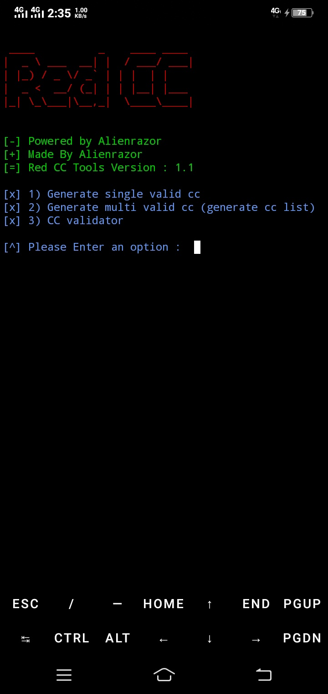

# Red-CC

pkg update && upgrade

pkg install python

pkg install python2

pip install setuptools

pip install requests

pip install mechanize

pkg install git

git clone https://github.com/Alienrazor/Red-CC

cd Red-CC

pip install -r requirements.txt

ls

python cc.py

#

#
# DISCLAIMER
THIS TOOL USED WITH YOUR OWN RESPONSIBILITIES

OTHERWISE I'M NOT RESPONSIBLE FOR ANY ILLEGAL ACTIVITIES 
